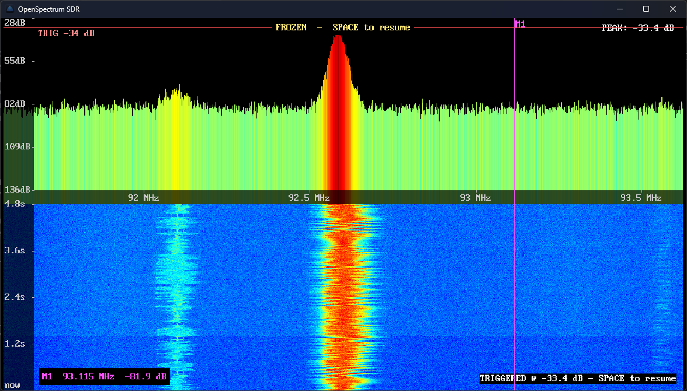

# OpenSpectrum: Modular SDR Spectrum Analyzer

*Divide et impera — Modular architecture for SDR signal processing*

[](LICENSE)

OpenSpectrum is a **modular Software-Defined Radio (SDR) spectrum analyzer** built with extensibility at its core. Designed with the **divide et impera** (divide and conquer) principle, the project separates concerns into distinct modules — hardware abstraction, signal processing, FFT analysis, visualization, and rendering — enabling seamless integration of future SDR devices, from RTL2832U to proprietary hardware.

Inspired by GNU Radio's pipeline architecture, OpenSpectrum provides a lightweight, real-time spectrum analysis platform that is both performant and maintainable.

<p align="center" width="100%">
    
</p>

> [!IMPORTANT]
> RTL-SDR outputs complex IQ samples, which is why you get bandwidth roughly equal to the sample rate!

## Conceptual preview

For:

```bash
fc = 98.8 MHz  # center_frequency
fs = 2.048 MS/s  # sample_rate
```

effective observed bandwidth we receive corresponds to:

```bash
97.776 ---------------- 98.8 ---------------- 99.824 MHz
          <- 1.024 MHz -> <- 1.024 MHz ->
```

all simultaneously in the IQ stream.

### FFT size, resolution, and where the data stops being real

The **span you see is set only by the sample rate** (`fs`) — the FFT size never adds
bandwidth, it only slices that fixed span more finely:

```bash
bin resolution   Δf   = fs / N          # N = FFT size
frame time       Δt   = N  / fs          # how long one FFT covers
```

| fs | N | Δf (resolution) | Δt (latency) |
|----|---|-----------------|--------------|
| 2.048 MS/s | 2048 | 1000 Hz/bin | 1 ms |
| 2.048 MS/s | 16384 | 125 Hz/bin | 8 ms |
| 1.024 MS/s | 16384 | 62.5 Hz/bin | 16 ms |

Bigger `N` → finer frequency, coarser time, more latency. That trade is fixed; you
cannot get both. Past the point where `Δt` exceeds the signal's coherence time, extra
bins just show the same noise at tighter spacing — no new information.

**Where you stop seeing the device and start seeing artifacts:**

- **`fs` above ~2.4 MS/s** — USB 2.0 can't keep up, buffers drop, and the dropouts
  show up as broadband glitches and spurs. This is the practical ceiling.
- **Band edges** — the R820T2 tuner's analog IF filter (auto-set, roughly tracks `fs`)
  rolls off the outer ~10–20 % of the span. The edges are filter shape, not flat
  response.
- **Center bin** — DC offset and LO leakage put a spike at `fc` regardless of tuning.
- **Valid `fs` ranges** — the RTL only accepts **225–300 kS/s** and **900 kS/s–3.2 MS/s**;
  the gap in between is rejected.

So the clean working window is roughly **0.9–2.4 MHz**: the middle ~80 % of the span is
real device data, the edges are tuner roll-off, and the center is the DC artifact.

### What the PEAK readout means

The top-right `PEAK` value is **dBFS — decibels relative to full scale**, not watts or
dBm. The IQ samples are normalized to `[-1, 1]`, so `0 dB` corresponds to the ADC's full
scale; everything real reads below it (the noise floor typically lands around
`-70…-100 dBFS` depending on FFT size, window, and gain). It is an **uncalibrated
relative** level — there is no antenna gain, impedance, or cable-loss term, so it cannot
be converted to absolute power (dBm) without a per-gain calibration offset.

## Features

| Feature | Description |
|--------|-------------|
| **Multi-Device Support** | RTL2832U (via librtlsdr) with architecture ready for proprietary SDR hardware |
| **Real-Time FFT Analysis** | Configurable FFT size (1024–16384), six window functions, and DC removal |
| **Dual Visualization** | GPU-rendered spectrum display + waterfall display, with five color palettes |
| **Cursor Readout** | Hover the spectrum or waterfall for a live frequency + amplitude (or time-ago) readout under the cursor |
| **Frequency Markers** | Click to drop persistent reference lines (with live level) that track frequency as you tune — mark and watch known channels |
| **Trace Modes** | Max-hold and video (EMA) averaging traces overlaid on the live spectrum |
| **Amplitude Trigger** | Shift-drag a dB threshold line; a bin peak crossing it freezes the display to catch transients too fast for human reaction (`Space` resumes) |
| **HF Reception** | `--ppm` correction, `--bias-t` antenna power, and `--direct-sampling` for the HF range |
| **IQ Capture & Playback** | Record raw IQ to disk (`Ctrl+S`) and replay captures with `--play` — no hardware needed |
| **PNG Spectrogram Export** | One-key export of the current spectrum + waterfall to an image |
| **SDL3 GUI** | Hardware-accelerated rendering with responsive design |
| **Power-Aware Rendering** | Vsync-paced with an optional `--max-fps` cap (default 30) that throttles below refresh to cut GPU/battery draw for long unattended measurements |
| **Modular Design** | Plug-and-play architecture: swap hardware backends without modifying core logic |
| **Security-Hardened** | Compiled with `-D_FORTIFY_SOURCE=2`, stack protection, RELRO, and more |

---

## Architecture

The project embraces the **divide and conquer** strategy, decomposing SDR processing into isolated, interchangeable modules.

Each module communicates via well-defined interfaces. By following community standards (librtlsdr, pocketfft), compatibility and ease of adoption is ensured.

### Module Directory Structure

```
OpenSpectrum/
├── src/
│   ├── hardware/          # SDR device abstraction (RTL2832U, future devices)
│   ├── signal/            # Signal conditioning (DC removal, windowing)
│   ├── fft/               # Fast Fourier Transform & spectral analysis
│   ├── visualization/     # Spectrum & waterfall rendering logic
│   ├── gui/               # SDL3 window and event management
│   └── utils/             # Logging, configuration, utilities
├── include/
├── third_party/
|   ├── stb/               # stb_image_write — PNG spectrogram export
│   └── pocketfft/         # High-performing FFT library
└── Makefile               # Security-hardened build system
```

---

## Installation

> [!NOTE]
> This driver step is Windows-only. On Linux and macOS, librtlsdr talks to the
> device directly — skip ahead to [Prerequisites](#prerequisites).

On **Windows 10 and later**, install the RTL2832U driver before building or
running OpenSpectrum. Follow the official
[RTL-SDR quick-start guide](https://www.rtl-sdr.com/rtl-sdr-quick-start-guide/),
which walks through replacing the default driver with the Zadig WinUSB driver.

If the device stops being detected after a Windows Update, the update has likely
reinstalled the generic Realtek DVB-T driver over WinUSB. Re-running Zadig fixes
it; on some systems you may also need to disable **Core Isolation → Memory
Integrity**, which can block the driver swap. The guide's **Troubleshooting**
section covers both cases.

## Prebuilt binaries

Check out the Releases page for latest Windows and Linux compatible releases.

> [!NOTE]
> The Windows `.exe` is currently **unsigned**, so Windows Defender's machine-learning
> heuristic may flag it as `Trojan:Win32/Wacatac.C!ml` and quarantine it. This is a
> **false positive** (typically ~1/61 on VirusTotal) common to unsigned, freshly-built
> C/C++ tools — it is not malware, and the source is open for inspection. Until the
> binaries are code-signed you can restore the file from quarantine (or submit the
> false positive to Microsoft). Signed releases are planned.

### Prerequisites

OpenSpectrum runs on **Linux** and **Windows** (native, or via `WSL2`). **macOS** builds are supported in principle (Homebrew dependencies below) but are currently untested — reports welcome.

| Dependency | Purpose | Installation Command (Ubuntu/Debian) |
|-----------|---------|--------------------------------------|
| `g++` / `clang++` | C++20 Compiler | `sudo apt install build-essential` |
| `make` | Build system (optional) | `sudo apt install make` |
| `librtlsdr-dev` | RTL-SDR hardware support | `sudo apt install librtlsdr-dev` |
| `libsdl3-dev` | GUI rendering | `sudo apt install libsdl3-dev` |
| `pkg-config` | Dependency detection | `sudo apt install pkg-config` |

**macOS (Homebrew):**
```bash
brew install librtlsdr sdl3 pkg-config
```

**Windows (MSYS2) build:**
```bash
pacman -S mingw-w64-x86_64-gcc mingw-w64-x86_64-make \
       mingw-w64-x86_64-rtl-sdr mingw-w64-x86_64-sdl3
```

---

## Build from Source

This project compiles with `-march=haswell` as the architectural baseline, targeting CPUs from 2013+ with support for:
- **SSE4.1 / SSE4.2** — Advanced SIMD instructions
- **AVX2** — 256-bit integer/float SIMD
- **POPCNT** — Population count instruction
- **CX16** — Compare and exchange 16-byte
- **SAHF / FXSR** — Legacy x87 state management

This should cover virtually all x86-64 processors in active use. For older CPUs, remove `-march=haswell` from `CXXFLAGS` in the Makefile.

```bash
# Clone the repository
git clone https://github.com/domagoj-kod/OpenSpectrum.git
cd OpenSpectrum

# Build with debug symbols
make debug

# Build optimized release
make release

# Clean build artifacts
make clean
```

| Target | Optimization | Debug Info | Use Case |
|--------|--------------|------------|----------|
| `make` or `make debug` | `-O0` | Full (`-g`) | Development, debugging |
| `make release` | `-O3 -flto -march=haswell` | None (`-DNDEBUG`) | Production |
| `make profile` | `-O2 -pg` | Full (`-g`) | Performance analysis |

All builds are security-hardened (FORTIFY, stack protector, RELRO + immediate
binding, non-exec stack) — see [Security](#security) for the full flag table.

---

## Usage

### Quick Start

```bash
# Run the spectrum analyzer (RTL-SDR required)
./openspectrum --help
Usage: ./openspectrum [OPTIONS]

OpenSpectrum - SDR Spectrum Analyzer

Options:
  -f, --freq HZ       Center frequency in Hz (default: 92600000)
  -r, --rate HZ       Sample rate in Hz (default: 2048000)
  -g, --gain DB       Gain in dB (default: 10.0)
  -s, --fft-size N    FFT size (power of 2, default: 4096)
  -w, --width N       Display width in pixels (default: 1050)
  -H, --height N      Display height in pixels (default: 576)
  -W, --window NAME   Window function: rectangle, hann, hamming,
                      blackman, blackman-harris, flat-top
                      (default: blackman-harris)
  --max-fps N         Cap render rate to N fps to cut GPU/battery draw
                      (default: 30; 0 = uncapped, vsync-limited)
  --ppm N             Crystal frequency correction in ppm (default: 0)
  --bias-t            Power the antenna port (4.5 V bias tee)
  --direct-sampling   Q-branch direct sampling for HF (tunes 0-14.4 MHz)
  --iq-log            Enable IQ data logging to file
  --iq-duration SEC   Capture duration in seconds (default: 0 = manual)
  --iq-output FILE    Output filename prefix (default: auto-generated)
  --play FILE.iq      Replay a recorded IQ capture instead of opening
                      hardware (loops; reads freq/rate from the
                      .meta.json sidecar when present)
  --help              Show this help message

Examples:
  ./openspectrum -f 100000000 -g 20
  ./openspectrum --freq 144500000 --gain 15 --fft-size 8192
  ./openspectrum -W hann
  ./openspectrum --iq-log --iq-duration 10 --iq-output my_capture
  ./openspectrum --direct-sampling -f 7100000      # 40 m band, HF
  ./openspectrum --play data/capture_20260610.iq   # no hardware needed
```

Apart from command-line arguments, the program is driven by keyboard shortcuts for frequency tuning, gain control, FFT size, and window-function selection. By default each tuning step is **1 MHz / 1 dB**; hold **Shift** for fine control (**0.1 MHz / 0.1 dB**) or **Ctrl** for coarse control (**10 MHz / 10 dB**).

### Keyboard Controls

| Key | Action |
|-----|--------|
| `+/=` | Increase the center frequency |
| `-/_` | Decrease the center frequency |
| `r` | Increase gain |
| `f` | Decrease gain |
| `1`–`5` | Set FFT size (1024, 2048, 4096, 8192, 16384) |
| `Ctrl` (modifier) | Coarse control (10 MHz, 10 dB) |
| `Shift` (modifier) | Fine control (0.1 MHz, 0.1 dB) |
| `UP` / `DOWN` | Cycle window functions forward / backward |
| `c` / `Shift+C` | Cycle color palette forward / backward (JET, VIRIDIS, HOT, GRAY, BLU-RED) |
| `m` | Toggle max-hold trace (white line at the per-bin running peak) |
| `a` | Toggle video averaging (EMA-smoothed spectrum bars) |
| `x` | Reset traces (clear held peaks, re-seed the average) |
| `t` | Toggle the frame-timing overlay (HUD) |
| `Ctrl+S` | Toggle IQ logging |
| `e` | Export spectrogram as PNG |
| `Space` | Resume from an amplitude-trigger freeze (re-arms the trigger) |
| `ESC` / `q` | Exit the program |
| `Ctrl+C` | Graceful shutdown (terminal) |

### Mouse Controls

- **Hover** the spectrum or waterfall for a live readout: a cursor at that frequency showing the amplitude (spectrum) or how long ago the line was captured (waterfall), in a fixed panel.
- **Left-click** drops a persistent frequency marker — a vertical reference line through both panes, tagged `Mn`, with its frequency and live level listed in the bottom-left panel. Markers track frequency as you retune (up to 16).
- **Right-click** removes the nearest marker; **Delete** clears all.
- **Shift + left-drag** in the spectrum pane sets the **amplitude trigger** — a horizontal threshold line at the pointer's dB. When a bin peak crosses it, the display **freezes** on the triggering frame (so a transient too fast for human reaction is held); the status bar and a centered banner show the event. Press **`Space`** to resume and re-arm. Drag the line onto the bottom edge of the pane to disarm it. Plain mouse keeps the hover/marker behavior above — the trigger uses Shift so it adds no new keybinding.

### Command-Line Configuration (Future)

> *Planned for upcoming releases*

```bash
# Use a specific RTL-SDR device index
./openspectrum --device 0

# Headless mode (data output only)
./openspectrum --headless --output spectrum.csv
```

---

## Supported Window Functions

- `RECTANGLE`
- `HANN`
- `HAMMING`
- `BLACKMAN`
- `BLACKMAN_HARRIS` (default)
- `FLAT_TOP`

---

## Adding New SDR Devices

The modular design keeps the device behind a narrow surface, so adding hardware
doesn't touch the rest of the pipeline. OpenSpectrum currently ships one concrete
backend, `RtlSdrDevice` (`src/hardware/rtl_sdr_device.{h,cpp}`). There is no
abstract base class yet — extracting an `SdrDeviceBase` is the natural refactor
once a second device lands; until then, a new backend simply mirrors
`RtlSdrDevice`'s public interface.

### 1. Mirror the device interface

A backend exposes lifecycle, tuning, and streaming. The pipeline is fed
**asynchronously**: you register a callback, and the device's producer thread
pushes pooled `FrameHandle`s of IQ samples as they arrive (rather than the
pipeline pulling fixed-size reads).

```cpp
// src/hardware/new_sdr_device.h
#pragma once
#include "openspectrum/frame_pool.h"
#include <functional>

class NewSdrDevice {
public:
    bool open();
    void close();
    bool is_open() const;

    void set_frequency(uint32_t freq_hz);
    void set_sample_rate(uint32_t rate_hz);
    void set_gain(float gain_db);

    // Streaming: register a sink, then start. The device owns its producer
    // thread and hands the pipeline cache-aligned FrameHandles.
    using FrameCallback = std::function<void(openspectrum::FrameHandle)>;
    void set_frame_callback(FrameCallback cb);
    void start_streaming(size_t buffer_count = 8);
    void stop_streaming();
};
```

### 2. Wire it into the pipeline

`main.cpp` constructs the device, points its frame callback at
`async_sample_callback`, and starts streaming. Swapping in your backend is the
only change — everything downstream consumes `FrameHandle`s and is
source-agnostic. (The `--play` IQ-playback path proves the point: it drives the
same callback with no device at all.)

**The rest of the signal chain — processor, FFT, visualization — remains untouched.** This is the power of *divide et impera*.

---

## Testing

There is no automated test suite. OpenSpectrum is a real-time GUI/SDR
application whose behavior is verified by running it against live hardware (or a
recorded `.iq` capture via `--play`); the former standalone test probes were
removed before v3.0.0. Validation is manual — build, run, and confirm the
spectrum/waterfall and controls behave as expected.

### Verify Hardware

Ensure your RTL-SDR device is detected:

```bash
# List available RTL-SDR devices
rtl_test -t

# Check device information
rtl_eeprom
```

---

## Performance Notes

Dell Precision notebook with Intel® Core™ i7-12700H processor displays minimal usage under maximum size FFT computations, utilizing <1.8% CPU and occupying ~57 MB of system memory.

- **FFT Performance:** pocketfft provides SIMD accelerated FFT computation.
- **Sample Rate:** Maximum stable rate depends on USB 2.0 bandwidth (~40 MB/s).
- **Latency:** End-to-end latency is vsync-bound (~16.7 ms/frame at 60 FPS). The
  actual per-frame compute (DC removal + window + FFT + render-command build) is
  only a small fraction of that budget and stays roughly flat across FFT sizes —
  the pipeline is present-bound, not compute-bound, so the frame rate holds at
  the cap from 4096 through 16384.

### Rendering backends

Rendering goes through SDL3's renderer, and **the default backend is the right one** —
Direct3D 11 on Windows, OpenGL on Linux — both hold a clean 60 fps with ~1 ms of CPU.
The pipeline is render-backend-bound rather than compute-bound, so the frame-timing HUD
(`t`) mostly shows the vsync idle-wait, not real work — a large `present`/`build`
number is the loop waiting for the next refresh, not a slow path.

- **Don't force Vulkan on older Intel integrated GPUs** (HD 6xx / Gen9 and similar):
  `SDL_RENDER_DRIVER=vulkan` there runs at roughly half the frame rate for no benefit.
- **Software rendering** (no GPU) works and warns loudly, but does all rasterization on
  a single CPU core — use `--max-fps 30` to cut its power and thermal cost on low-end
  machines running on battery.

### GPU spectrum rendering

The amplitude spectrum is drawn directly on the GPU (one `SDL_RenderGeometry`
call, one colored quad per bin) instead of being CPU-painted into a pixel
buffer and uploaded every frame. This removed the per-frame ~1.5 MB CPU→GPU
texture upload and a redundant IQ-frame copy (the FFT input is now processed
in place via `std::span`).

Measured on the i7-12700H above, native Windows (Direct3D 11, vsync 60 FPS),
against the prior CPU-painted build. Intel VTune confirms the mechanism
(4096 FFT):

- **Back-end Memory Bound halved** (21.6% → 11.5% of pipeline slots) — the
  strided pixel paint + upload were memory-bandwidth/latency + DTLB bound;
  that fingerprint is gone.
- **Total CPU time −32%, spin time −40%**, and the Direct3D present/upload
  path (`dxgi.dll`) dropped **−48%** (3.24 s → 1.67 s over a 25 s capture).
  The application's own functions fall below the top-hotspot noise floor.
- The GPU execution-unit array is idle in both builds — the cost was always
  CPU-side driver/upload, which is what was eliminated.

### Memory footprint

Heap use is kept low and mostly *bounded* rather than growing freely with FFT
size. On the i7-12700H above (native Windows, Direct3D 11), resident memory is
**~57 MB at a 16384-point FFT** — the largest supported transform — and lower
at smaller sizes.

The buffers that do scale with FFT size are deliberately right-sized:

- **Frame pools are bounded, not generous.** The FFT frame pool pre-allocates
  12 buffers and the producer→render queue is capped at 8; the renderer drops
  all but the newest queued frame each paint, so a deeper queue would only hold
  backlog that gets discarded anyway. The device-side USB pool holds 4 buffers
  (only one is ever in flight). Capping the queue bounds the pool's peak.
- **The ~1 MB IQ write buffer is allocated only while a capture is running**
  (`Ctrl+S`) and released on stop, so an idle session holds none of it.
- The amplitude spectrum is GPU-drawn (see above), so there is **no CPU pixel
  buffer** for it at all; only the waterfall keeps a CPU-side image, quantized
  to one byte per cell — a 4:1 saving over float.

> A Linux memory profile (e.g. Valgrind Massif under WSL2) reads much higher —
> most of it is the Mesa software-OpenGL backing store, an artifact of running
> without GPU passthrough. The Windows Direct3D 11 build keeps those surfaces in
> video memory rather than the heap, so the ~57 MB figure is the representative
> one.

---

## Security

OpenSpectrum is compiled with **security-hardened flags** by default:

| Flag | Purpose |
|------|---------|
| `-D_FORTIFY_SOURCE=2` | Buffer overflow protection |
| `-fstack-protector-strong` | Stack canary protection |
| `-Wl,-z,now` | Disable lazy binding |
| `-Wl,-z,relro` | Relocation read-only |
| `-Wl,-z,noexecstack` | Non-executable stack |
| `-Wall -Wextra -Wpedantic` | Comprehensive warnings |

---

## License

This project is licensed under the **GNU General Public License v3.0 (or later)** — see [LICENSE](LICENSE) for details.

```
                    GNU GENERAL PUBLIC LICENSE
                       Version 3, 29 June 2007

 Copyright (C) 2007 Free Software Foundation, Inc. <https://fsf.org/>
 Everyone is permitted to copy and distribute verbatim copies
 of this license document, but changing it is not allowed.

                            Preamble

  The GNU General Public License is a free, copyleft license for
software and other kinds of works...
```

---

## Contributing

Contributions are welcome! Please follow these guidelines:

1. **Modularity First:** New features should be added as separate modules when possible.
2. **Security:** Maintain the existing security flags in the Makefile.
3. **Validation:** There is no automated test suite — verify changes by building and running against live hardware or a recorded capture (`--play`), and note what you checked.
4. **Documentation:** Update this README for significant changes.

### Development Workflow

1. Fork the repository
2. Create a feature branch (`git checkout -b feature/amazing-feature`)
3. Commit your changes (`git commit -m 'feat: add amazing feature'`)
4. Push to the branch (`git push origin feature/amazing-feature`)
5. Open a Pull Request

---

## Acknowledgments

- **librtlsdr** — RTL-SDR device library
- **pocketfft** — Fast Fourier Transform implementation by Martin Reinecke
- **SDL3** — Simple DirectMedia Layer for cross-platform rendering
- **GNU Radio** — Inspiration for modular SDR pipeline architecture

---

*Built with ❤️ for the SDR community*
