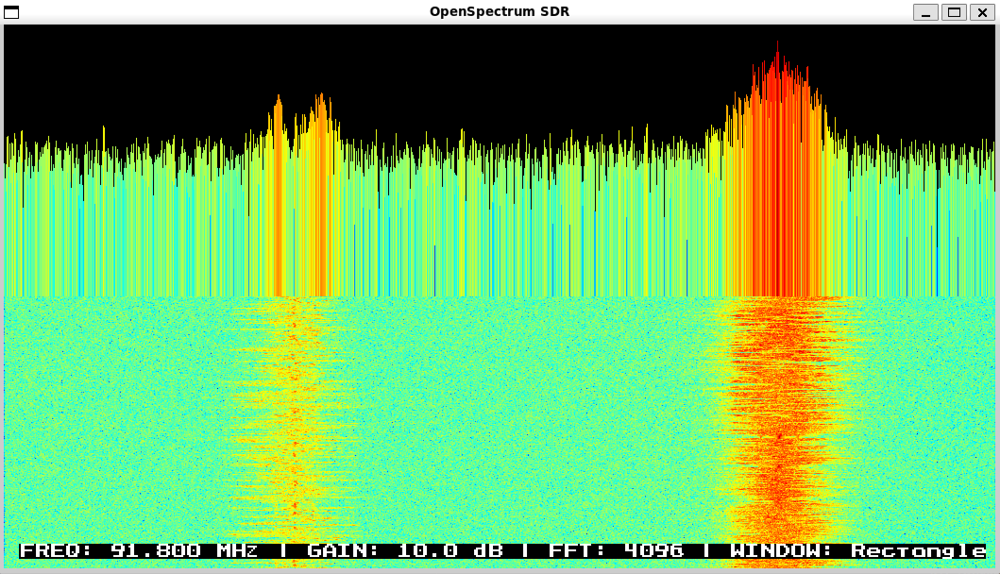

# OpenSpectrum: Modular SDR Spectrum Analyzer

*Divide et impera — Modular architecture for SDR signal processing*

[](LICENSE)

OpenSpectrum is a **modular Software-Defined Radio (SDR) spectrum analyzer** built with extensibility at its core. Designed with the **divide et impera** (divide and conquer) principle, the project separates concerns into distinct modules — hardware abstraction, signal processing, FFT analysis, visualization, and rendering — enabling seamless integration of future SDR devices, from RTL2832U to proprietary hardware.

Inspired by GNU Radio's pipeline architecture, OpenSpectrum provides a lightweight, real-time spectrum analysis platform that is both performant and maintainable.

<p align="center" width="100%">
    
</p>

> [!IMPORTANT]
> RTL-SDR outputs complex IQ samples, which is why you get bandwidth roughly equal to the sample rate!

## Conceptual preview

For:

```bash
fc = 98.8 MHz  # center_frequency
fs = 2.048 MS/s  # sample_rate
```

effective observed bandwidth we receive corresponds to:

```bash
97.776 ---------------- 98.8 ---------------- 99.824 MHz
          <- 1.024 MHz -> <- 1.024 MHz ->
```

all simultaneously in the IQ stream.

## Features

| Feature | Description |
|--------|-------------|
| **Multi-Device Support** | RTL2832U (via librtlsdr) with architecture ready for proprietary SDR hardware |
| **Real-Time FFT Analysis** | Configurable FFT size, window functions, and DC removal |
| **Dual Visualization** | Spectrum display + waterfall display for temporal signal analysis |
| **SDL2 GUI** | Hardware-accelerated rendering with responsive design |
| **Modular Design** | Plug-and-play architecture: swap hardware backends without modifying core logic |
| **Security-Hardened** | Compiled with `-D_FORTIFY_SOURCE=2`, stack protection, RELRO, and more |

---

## Architecture

The project embraces the **divide and conquer** strategy, decomposing SDR processing into isolated, interchangeable modules.

Each module communicates via well-defined interfaces. By following community standards (librtlsdr, KissFFT), compatibility and ease of adoption is ensured.

### Module Directory Structure

```
OpenSpectrum/
├── src/
│   ├── hardware/          # SDR device abstraction (RTL2832U, future devices)
│   ├── signal/            # Signal conditioning (DC removal, windowing)
│   ├── fft/               # Fast Fourier Transform & spectral analysis
│   ├── visualization/     # Spectrum & waterfall rendering logic
│   ├── gui/               # SDL2 window and event management
│   └── utils/             # Logging, configuration, utilities
├── include/
├── third_party/
│   └── kissfft/           # Lightweight FFT library
└── Makefile               # Security-hardened build system
```

---

## Installation

> [!WARNING]
> Skip this step when using macOS on Unix-like OS.

To install RTL2832U device drivers on **Windows 10**+ follow the official [start guide](https://www.rtl-sdr.com/rtl-sdr-quick-start-guide/). This is the **Step 0**. Windows users might need to disable *Memory Integrity Protection* setting option as windows tends to replace the original drivers with generic Realtek ones. See **Troubleshooting** section of the [start guide](https://www.rtl-sdr.com/rtl-sdr-quick-start-guide/).

## Prebuilt binaries

Check out the Releases page for latest Windows and Linux compatible releases.

### Prerequisites

OpenSpectrum is **platform-agnostic** and supports Linux, macOS (in theory at least), and Windows (native support or via `WSL2`).

| Dependency | Purpose | Installation Command (Ubuntu/Debian) |
|-----------|---------|--------------------------------------|
| `g++` / `clang++` | C++20 Compiler | `sudo apt install build-essential` |
| `make` | Build system (optional) | `sudo apt install make` |
| `librtlsdr-dev` | RTL-SDR hardware support | `sudo apt install librtlsdr-dev` |
| `libsdl2-dev` | GUI rendering | `sudo apt install libsdl2-dev` |
| `pkg-config` | Dependency detection | `sudo apt install pkg-config` |

**macOS (Homebrew):**
```bash
brew install librtlsdr sdl2 pkg-config
```

**Windows (MSYS2) build:**
```bash
pacman -S mingw-w64-x86_64-gcc mingw-w64-x86_64-make \
       mingw-w64-x86_64-rtl-sdr mingw-w64-x86_64-SDL2
```

---

## Build from Source

This project compiles with `-march=nehalem` as the architectural baseline, targeting CPUs from 2008+ with support for:
- **SSE4.1 / SSE4.2** — Advanced SIMD instructions
- **POPCNT** — Population count instruction
- **CX16** — Compare and exchange 16-byte
- **SAHF / FXSR** — Legacy x87 state management

This should cover virtually all x86-64 processors in active use. For older CPUs, remove `-march=nehalem` from `CXXFLAGS` in the Makefile.

```bash
# Clone the repository
git clone https://github.com/domagoj-kod/OpenSpectrum.git
cd OpenSpectrum
git submodule update --init --recursive

# Build with debug symbols
make debug

# Build optimized release
make release

# Clean build artifacts
make clean
```

| Target | Optimization | Debug Info | Use Case |
|--------|--------------|------------|----------|
| `make` or `make debug` | `-O0` | Full (`-g`) | Development, debugging |
| `make release` | `-O3 -flto -march=nehalem` | None (`-DNDEBUG`) | Production |
| `make profile` | `-O2 -pg` | Full (`-g`) | Performance analysis |

All builds include:
- `-D_FORTIFY_SOURCE=2` — Buffer overflow protection
- `-fstack-protector-strong` — Stack smashing protection
- `-Wl,-z,now -Wl,-z,relro` (Unix) — ASLR/PIE hardening

---

## Usage

### Quick Start

```bash
# Run the spectrum analyzer (RTL-SDR required)
./openspectrum --help
Usage: ./openspectrum [OPTIONS]

OpenSpectrum - SDR Spectrum Analyzer

Options:
  -f, --freq HZ       Center frequency in Hz (default: 92600000)
  -r, --rate HZ       Sample rate in Hz (default: 2048000)
  -g, --gain DB       Gain in dB (default: 10.0)
  -s, --fft-size N    FFT size (power of 2, default: 4096)
  -w, --width N       Display width in pixels (default: 1050)
  -H, --height N      Display height in pixels (default: 576)
  -W, --window NAME   Window function: rectangle, hann, hamming,
                      blackman, blackman-harris, flat-top
                      (default: blackman-harris)
  --iq-log            Enable IQ data logging to file
  --iq-duration SEC   Capture duration in seconds (default: 0 = manual)
  --iq-output FILE    Output filename prefix (default: auto-generated)
  --help              Show this help message

Examples:
  ./openspectrum -f 100000000 -g 20
  ./openspectrum --freq 144500000 --gain 15 --fft-size 8192
  ./openspectrum -W hann
  ./openspectrum --iq-log --iq-duration 10 --iq-output my_capture
```

> [!NOTE]
> The log batching is expected behavior for USB 2.0 RTL-SDR devices. The ~8.5 FPS frame rate is limited by USB transfer latency, not CPU/FFT. This is normal and acceptable for the current hardware configuration. Cosmetic issue, functionality works correctly.

Apart from command line arguments the program uses keyboard shortcuts for frequency tuning, gain control, Fast Fourier Transform size & window functions change. Shift modifer allows for fine control fine control (0.1 MHz, 0.1 dB), while Ctrl modifier is used for coarse control (1 MHz, 10 dB).

### Keyboard Controls

| Key | Action |
|-----|--------|
| `+/=` | Increase the center frequency |
| `-/_` | Decrease the center frequency |
| `r` | Increase gain |
| `f` | Decrease gain |
| `1-4` | Set FFT size (512, 1024, 2048, 4096) |
| `Ctrl` | Coarse control (10 MHz, 10 dB) |
| `Shift` | Fine control (0.1 MHz, 0.1 dB) |
| `UP` | Cycle through supported window functions |
| `DOWN` | Reverse through supported window functions |
| `Ctrl+S` | Toggle IQ logging |
| `e` | Export spectrogram as PNG |
| `ESC/q` | Exit the program |
| `Ctrl+C` | Graceful shutdown (terminal) |

### Command-Line Configuration (Future)

> *Planned for upcoming releases*

```bash
# Use a specific RTL-SDR device index
./openspectrum --device 0

# Headless mode (data output only)
./openspectrum --headless --output spectrum.csv
```

---

## Supported Window Functions

- `RECTANGLE`
- `HAMMING`
- `HANN`
- `BLACKMAN`
- `BLACKMAN_HARRIS` (default)
- `NUTTALL`
- `FLATTOP`

---

## Adding New SDR Devices

The modular design makes it straightforward to add support for new SDR hardware. Follow these steps:

### 1. Create a New Hardware Backend

```cpp
// src/hardware/new_sdr_device.h
#pragma once
#include "hardware/sdr_device_base.h"

class NewSdrDevice : public SdrDeviceBase {
public:
    bool open() override;
    void close() override;
    void set_frequency(uint32_t freq_hz) override;
    void set_sample_rate(uint32_t rate_hz) override;
    std::vector<std::complex<float>> read_samples(size_t count) override;
    // ... additional device-specific methods
};
```

### 2. Implement the Interface

All hardware backends must implement the `SdrDeviceBase` interface:

```cpp
// include/hardware/sdr_device_base.h (recommended addition)
class SdrDeviceBase {
public:
    virtual ~SdrDeviceBase() = default;
    virtual bool open() = 0;
    virtual void close() = 0;
    virtual bool is_open() const = 0;
    virtual void set_frequency(uint32_t freq_hz) = 0;
    virtual void set_sample_rate(uint32_t rate_hz) = 0;
    virtual void set_gain(float gain_db) = 0;
    virtual std::vector<std::complex<float>> read_samples(size_t count) = 0;
};
```

### 3. Integrate into Main Program

```cpp
// src/main.cpp
#include "hardware/new_sdr_device.h"

int main() {
    // Use polymorphism for device selection
    std::unique_ptr<SdrDeviceBase> device;
    
    device = std::make_unique<RtlSdrDevice>();
    
    if (!device->open()) {
        LOG_ERROR("Failed to open device");
        return 1;
    }
    // Rest of pipeline remains unchanged!
}
```

**The rest of the signal chain — processor, FFT, visualization — remains untouched.** This is the power of *divide et impera*.

---

## Testing

### Run Unit Tests

At the moment test suites are excluded from Makefile and standalone compilation is required.

### Verify Hardware

Ensure your RTL-SDR device is detected:

```bash
# List available RTL-SDR devices
rtl_test -t

# Check device information
rtl_eeprom
```

---

## Performance Notes

Dell Precision notebook with Intel® Core™ i7-12700H processor displays minimal usage under maximum size FFT computations, utilizing ~1% CPU power and 30 MB of system memory.

- **FFT Performance:** KissFFT provides optimized FFT computation. For larger FFT sizes (8192+), paralelization is required.
- **Sample Rate:** Maximum stable rate depends on USB 2.0 bandwidth (~40 MB/s).
- **Latency:** End-to-end latency is typically <50ms at 2.048 MS/s with FFT_SIZE=4096.

---

## Security

OpenSpectrum is compiled with **security-hardened flags** by default:

| Flag | Purpose |
|------|---------|
| `-D_FORTIFY_SOURCE=2` | Buffer overflow protection |
| `-fstack-protector-strong` | Stack canary protection |
| `-Wl,-z,now` | Disable lazy binding |
| `-Wl,-z,relro` | Relocation read-only |
| `-Wl,-z,noexecstack` | Non-executable stack |
| `-Wall -Wextra -Wpedantic` | Comprehensive warnings |

---

## License

This project is licensed under the **LGPL v3 License** — see [LICENSE](LICENSE) for details.

```
                    GNU GENERAL PUBLIC LICENSE
                       Version 3, 29 June 2007

 Copyright (C) 2007 Free Software Foundation, Inc. <https://fsf.org/>
 Everyone is permitted to copy and distribute verbatim copies
 of this license document, but changing it is not allowed.

                            Preamble

  The GNU General Public License is a free, copyleft license for
software and other kinds of works...
```

---

## Contributing

Contributions are welcome! Please follow these guidelines:

1. **Modularity First:** New features should be added as separate modules when possible.
2. **Security:** Maintain the existing security flags in the Makefile.
3. **Testing:** Add tests for new functionality.
4. **Documentation:** Update this README for significant changes.

### Development Workflow

1. Fork the repository
2. Create a feature branch (`git checkout -b feature/amazing-feature`)
3. Commit your changes (`git commit -m 'feat: add amazing feature'`)
4. Push to the branch (`git push origin feature/amazing-feature`)
5. Open a Pull Request

---

## Acknowledgments

- **librtlsdr** — RTL-SDR device library
- **KissFFT** — Fast Fourier Transform implementation by Mark Borgerding
- **SDL2** — Simple DirectMedia Layer for cross-platform rendering
- **GNU Radio** — Inspiration for modular SDR pipeline architecture

---

*Built with ❤️ for the SDR community*
